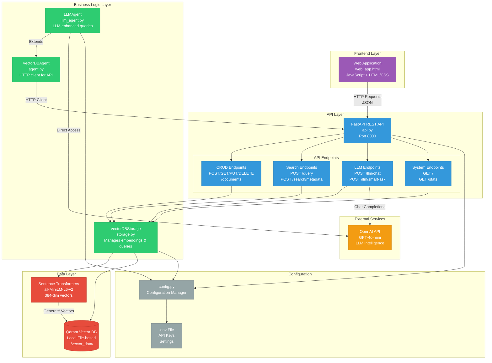
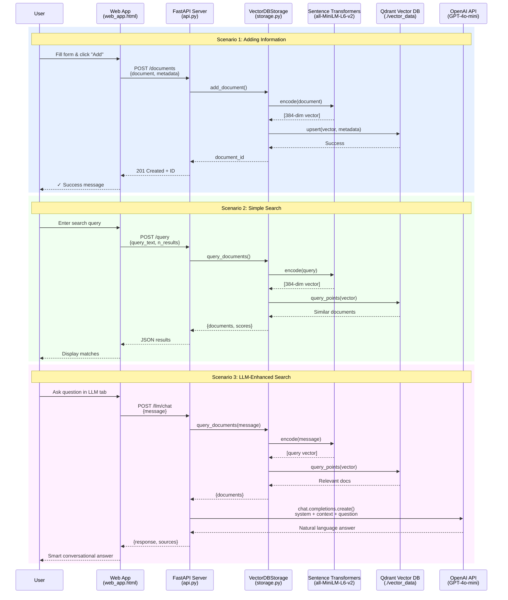
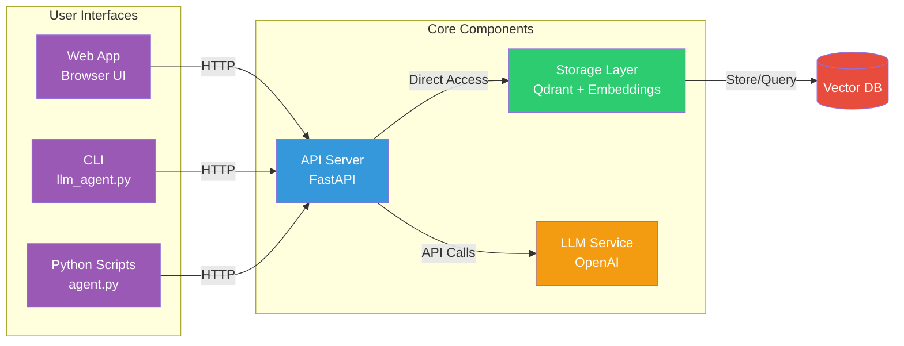
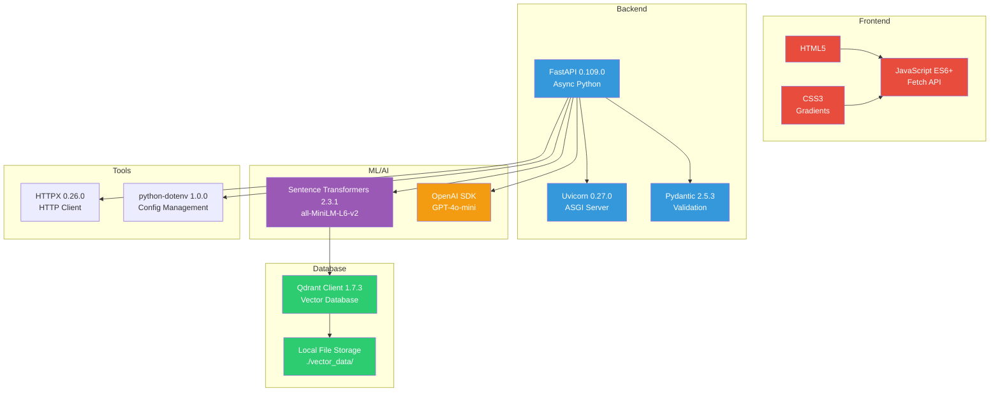

# Architecture Diagrams - Mermaid Code

## 1. System Architecture Diagram



## 2. Request Flow Sequence Diagram



## 3. Component Relationships Diagram



## 4. Technology Stack Diagram



---

## How to Use These Diagrams

### Option 1: VS Code (Already Rendered)
The diagrams above are already rendered in VS Code's Mermaid preview.

### Option 2: Online Mermaid Editors
1. Copy any diagram code block from above
2. Visit: https://mermaid.live/
3. Paste the code
4. View/export the diagram

### Option 3: Markdown Viewers
- GitHub/GitLab - Renders automatically in README.md
- Notion - Supports Mermaid blocks
- Obsidian - With Mermaid plugin

### Option 4: Export as Image
Use mermaid-cli:
```bash
npm install -g @mermaid-js/mermaid-cli
mmdc -i ARCHITECTURE.md -o architecture.png
```

---

## Diagram Descriptions

### 1. System Architecture
Shows all components, layers, and their relationships. Use this for understanding the overall system structure.

**Key Components:**
- **Purple**: Frontend (Web App)
- **Blue**: API Layer (FastAPI endpoints)
- **Green**: Business Logic (Storage, Agents)
- **Red**: Data Layer (Qdrant, Embeddings)
- **Orange**: External Services (OpenAI)
- **Gray**: Configuration

### 2. Request Flow Sequence
Shows step-by-step flow of three common operations:
1. **Adding Information** (Blue background)
2. **Simple Search** (Green background)
3. **LLM-Enhanced Search** (Purple background)

### 3. Component Relationships
Simplified view showing how users interact with the system through different interfaces.

### 4. Technology Stack
Complete technology stack with version numbers for all major dependencies.

---

## System Statistics

**Current State:**
- **Total Documents**: 8
- **Collection**: personal_info
- **Vector Dimensions**: 384
- **API Endpoints**: 12
- **LLM Provider**: OpenAI GPT-4o-mini
- **Database**: Qdrant (local file-based)

**File Breakdown:**
```
Frontend:     1 file  (web_app.html)
API:          1 file  (api.py) 
Storage:      1 file  (storage.py)
Agents:       2 files (agent.py, llm_agent.py)
Models:       1 file  (models.py)
Config:       2 files (config.py, .env)
Tests:        6 files
Docs:         8 files
Total Lines:  ~3,500+
```
